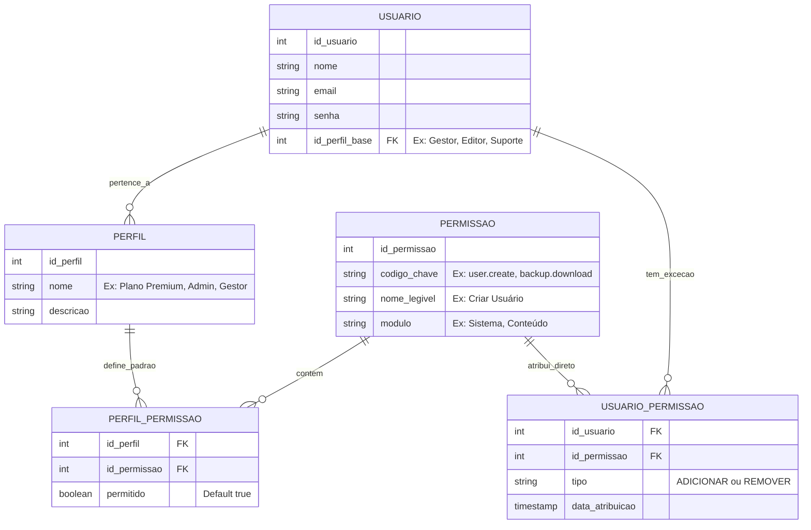
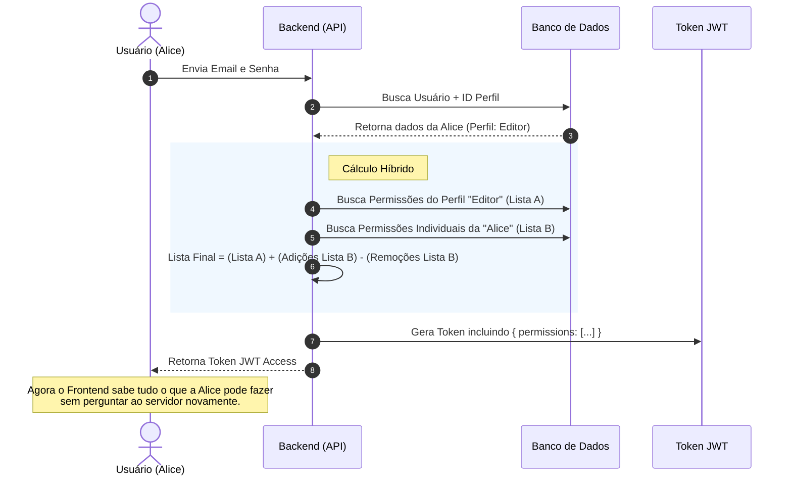

# Arquitetura de Permissões Híbrida (RBAC + Granular)

Esta documentação ilustra a arquitetura sugerida para o sistema de controle de acesso do Projeto LIGA. O objectivo é combinar a eficiência de **Perfis (Roles)** com a flexibilidade de **Permissões Individuais (Granular)**.

## 1. Modelo de Entidade-Relacionamento (Banco de Dados)

Neste modelo, o usuário tem um "Cargo" base (que dá a maioria das permissões), mas também tem uma tabela específica para excepções (adicionar ou remover poderes específicos).



---

## 2. Exemplos Práticos

### Cenário A: Usuário Padrão (Sem excepções)
O **Bruno** é contratado como **Suporte**.
1. O sistema olha pro cargo "Suporte".
2. O cargo "Suporte" tem permissão para: `ver_usuarios`, `resetar_senha`.
3. **Resultado**: Bruno pode `ver_usuarios` e `resetar_senha`.

### Cenário B: Usuário com Poder Extra (Granular)
A **Ana** é **Gestora de Conteúdo**, mas o chefe pediu para ela também fazer **Backups** (que normalmente só Admin faz).
1. Cargo "Gestor": Permite `criar_sinal`, `editar_sinal`.
2. Tabela `Usuario_Permissao` da Ana: Tem um registro EXTRA para `fazer_backup`.
3. **Resultado**: Ana pode `criar_sinal`, `editar_sinal` **E** `fazer_backup`.

### Cenário C: Usuário com Restrição (Granular)
O **Carlos** é **Admin**, mas fez besteira e foi proibido de **Deletar Usuários**.
1. Cargo "Admin": Permite `tudo`.
2. Tabela `Usuario_Permissao` do Carlos: Tem um registro do tipo **REMOVER** para `deletar_usuario`.
3. **Resultado**: Carlos pode fazer tudo, **EXCETO** deletar usuários.

---

## 3. Fluxo de Autenticação (Login)

Como o backend processa isso para não ficar lento.



## 4. Visualização na Interface (Admin Panel)

Sugestão de como criar a tela de edição de usuário para o Admin ver isso claramente.

```text
+---------------------------------------------------------------+
| EDITAR USUÁRIO: ANA (ID: 45)                                  |
+---------------------------------------------------------------+
| Cargo Base: [ Gestor de Conteúdo (v) ]                        |
| (Este cargo concede acesso a: Criar Sinais, Editar Sinais...) |
+---------------------------------------------------------------+
| PERMISSÕES INDIVIDUAIS (Personalizar)                         |
|                                                               |
| [ Sistema ]                                                   |
|   [ ] Ver Logs (Herdado: Não)                                 |
|   [x] Fazer Backup (Herdado: Não -> Adicionado Manualmente)   | <-- Poder Extra
|                                                               |
| [ Usuários ]                                                  |
|   [x] Listar Usuários (Herdado: Sim)                          |
|   [ ] Banir Usuário (Herdado: Não)                            |
|                                                               |
| [ Conteúdo ]                                                  |
|   [x] Criar Sinal (Herdado: Sim)                              |
|   [ ] Deletar Sinal (Herdado: Sim -> Removido Manualmente)    | <-- Restrição
+---------------------------------------------------------------+
```
